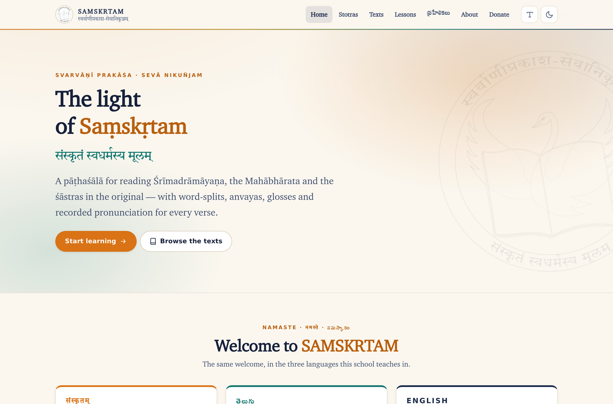
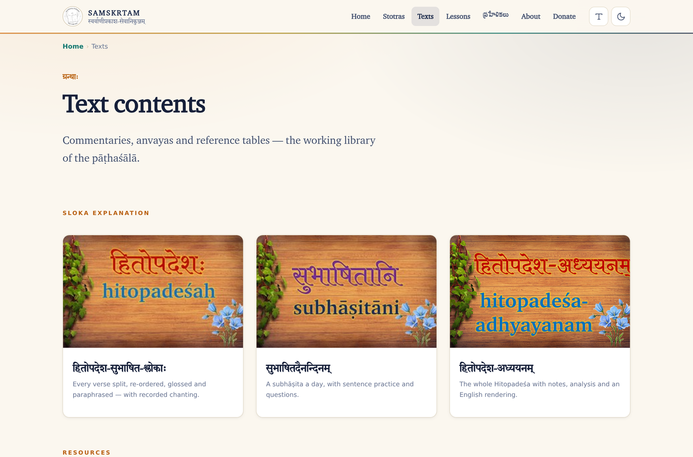
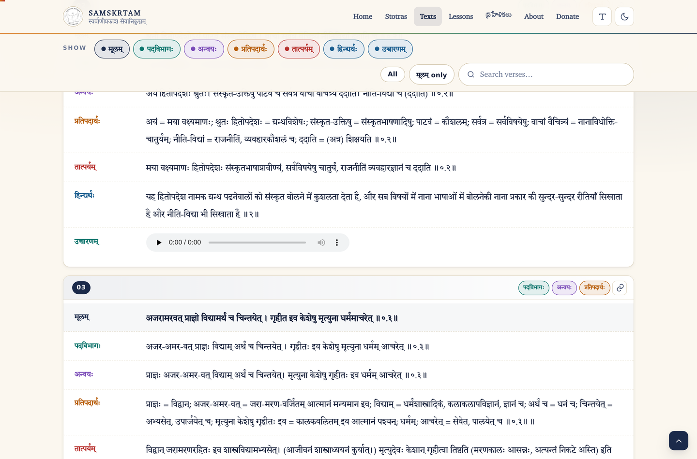
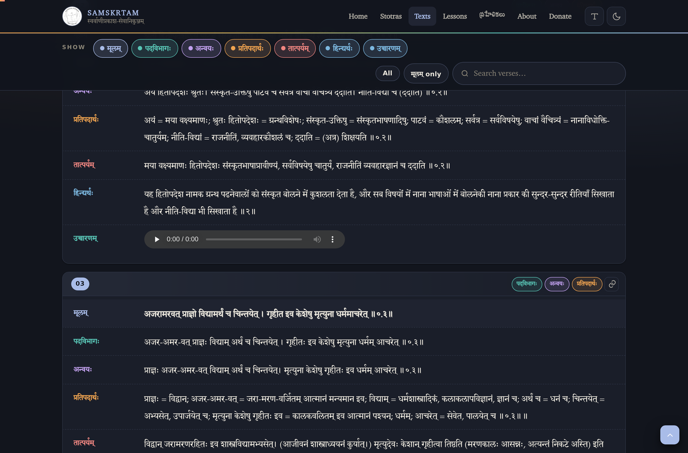
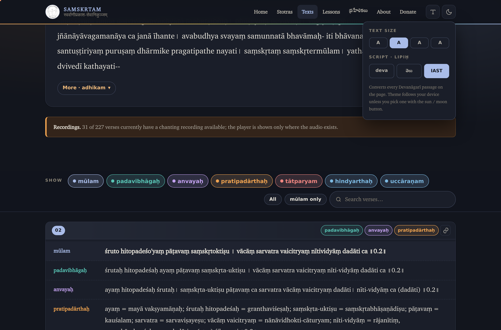
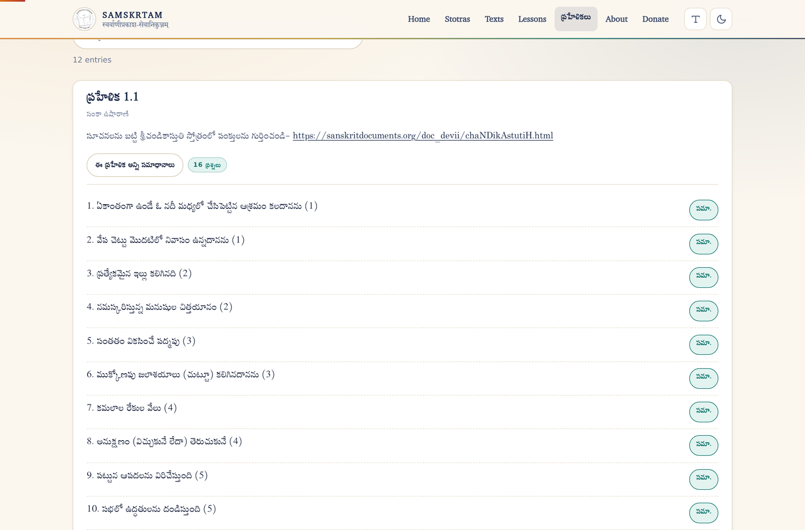

# samskrtam.info — clone and modernisation

A complete, self-contained mirror of **[samskrtam.info](https://samskrtam.info/)** — the site of
**स्वर्वाणीप्रकाश-सेवानिकुञ्जम् / Svarvāṇī Prakāśa · Sevā Nikuñjam**, the Sanskrit pāṭhaśālā run by
Usha Rani Sanka — together with a rebuilt, modern front end generated from the site's own content.

The school's identity is untouched: its seal, its motto (**संस्कृतं स्वधर्मस्य मूलम्**), its wording,
its trilingual welcome, its own Devanāgarī / Telugu / IAST typefaces, its links and its contact
details all carry over verbatim. What changed is everything around them.

---

## What is in this repository

```
original-site/     byte-for-byte mirror of the live site (reference baseline, never edited)
                   — also the single source for images, audio, fonts and worksheets
src/data/          the site's content, lifted out of that mirror into structured JSON
src/assets/        the authored front end: one stylesheet, two scripts
tools/extract.py   original-site/  →  src/data/
tools/build.py     src/data/ + src/assets/  →  dist/
tools/serve.py     local preview server
dist/              the generated static site — this is what you host
```

### Build it

```bash
pip install requests beautifulsoup4 lxml     # extraction only
python3 tools/extract.py                     # re-read the mirror into JSON
python3 tools/build.py                       # render dist/
python3 tools/serve.py                       # preview at http://localhost:8000
```

`dist/` is plain static files — no server, no database, no build step at runtime. Point any host at
it (GitHub Pages, Netlify, Cloudflare Pages, S3, or the folder itself) and it works. A `.nojekyll`,
`404.html`, `robots.txt` and `sitemap.xml` are generated for you.

---

## The clone

Crawled end to end with Python (`requests` + `BeautifulSoup`), following every internal link
including query-string pages:

- **47 pages** — home, stotras, texts, courses, prahelikas, donate, plus all nine content pages and
  every `course.php`, `stotra.php`, `prahelika.php` and paginated `hitopadesha-adhyayana.php` variant
- **`xml/adhyayanam.xml`** — the 1.8 MB Hitopadeśa study corpus the original fetches at runtime
- every reachable stylesheet, script, image and font, including three custom Indic faces
  (`Sanskrit2003`, `suranna`, `CharterIndologique`) that the stylesheet references but no page links
- the audio and PDF assets that are still live upstream

Some assets referenced by the original **404 upstream** and could not be retrieved: 196 of 227
Hitopadeśa chanting recordings and most of the Suravāṇī lesson worksheets. The mirror records what
the server actually returns; the rebuilt site shows an audio player or a worksheet button only where
the file exists, instead of a broken control.

---

## The modernisation

### Content is data now

The original inlines its scholarship into markup — a 1.5 MB PHP page of `<table>` rows per verse.
`tools/extract.py` recovers the structure into JSON, and `tools/build.py` renders it. Nothing is
rewritten, translated or summarised; only the shape changes. Verified against the mirror:

| corpus | entries | Devanāgarī content preserved |
|---|---|---|
| हितोपदेश-सुभाषित-श्लोकाः | 227 verses × 6 registers | 100.0 % |
| सुभाषितदैनन्दिनम् | 136 verses × 7 registers | 100.0 % |
| हितोपदेश-अध्ययनम् | 1 557 entries | 100 % (all XML groups) |
| धातुपाठविस्तरः | 2 101 dhātus | 100 % |
| श्रीमद्भगवद्गीतान्वयः | 18 chapters, 59 passages | 100 % |
| श्रीमद्रामायण-अनुक्रमणिका | 9 kāṇḍas | 100 % |
| सुलक्षणाचरितम् · सरित्सागरसंवादः | 3 sections each (76 extra verse blocks recovered) | 100 % |
| विष्णुसहस्रनामान्त-फलश्रुतिः | 4 speaker passages + श्लोकभागः | 100 % |
| Lessons | 530 across 12 courses | — |
| ప్రహేళికలు | 446 questions in 5 sets | 100 % |

### Three things the original site was hiding

Rebuilding from the data surfaced content that was present but unreachable:

1. **A third section in सुलक्षणाचरितम् and सरित्सागरसंवादः** (`सश्लोकपदविभागमन्वयः`, 61 and 15 verse
   blocks) was built differently from the rest of the page and is now included.
2. **A ninth column in धातुपाठविस्तरः.** The original stylesheet has `td:last-child { display:none }`
   — but 704 of the 2 101 rows carry a real grammatical note there (इदित्, उदित्, citations). It is
   now a visible, searchable **टिप्पणी** column.
3. **Gītā 1.1** (धृतराष्ट्र उवाच) sat before the chapter-1 heading in the markup and was easy to lose;
   it is attached to chapter 1.

One upstream duplicate was dropped: the Courses page listed the Amarakośa card twice, the second
mislabelled "Devavan" but pointing at the same course.

### Design

A palm-leaf-and-ink system built around what the school already used — cobalt headings, green
actions, a red accent, a black line-art seal — warmed and given a proper scale:

- **Colour**: deep indigo ink on parchment, saffron for action, teal and crimson as secondary
  accents, gold hairlines. Each register of a verse (मूलम् / पदविभागः / अन्वयः / प्रतिपदार्थः /
  तात्पर्यम् / …) has its own hue, so the eye can find a layer without reading labels.
- **Type**: the school's own faces do the work — Sanskrit2003 for Devanāgarī, Suranna for Telugu,
  Charter Indologique for Latin and IAST diacritics. Indic text never gets letter-spaced or
  uppercased, which is what broke the conjuncts in the original's headings.
- **Full dark mode**, following the device by default and overridable, with a persisted choice.
- **Responsive** from 320 px up, with a real mobile menu; no page scrolls sideways.

### Behaviour

Every interaction the original offered is kept, and rebuilt to be keyboard-reachable, announced to
assistive technology, and remembered between visits:

- **Register toggles** — the original's on/off buttons, now chips with per-verse overrides,
  "All" / "मूलम् only" shortcuts, and the reader's choice stored per corpus.
- **Script conversion** — the original loaded the Aksharamukha plugin from a CDN on every page. It is
  now built in (`src/assets/js/lipi.js`): Devanāgarī → Telugu and → IAST, converting the whole page
  including its own labels, offline, instantly, and losslessly reversible.
  `श्रुतो हितोपदेशोऽयं` → `śruto hitopadeśo'yaṃ` → `శ్రుతో హితోపదేశోఽయం`.
- **Search** across every corpus — 2 101 dhātus, 227 verses, 530 lessons, 446 puzzles — with a live
  result count. Indexes are built lazily so the page still loads instantly for readers who never type.
- **Deep links.** Every verse and entry has a stable id and a copy-link button:
  `/texts/hitopadesha/#v-042` scrolls to that verse and highlights it.
- **Reading size** control, for corpora that are dense on a phone.
- Speaker filtering in the Gītā, kāṇḍa jump-nav in the Rāmāyaṇa, per-puzzle and reveal-all answers
  in the prahelikās, language switching within a course.

### Performance and correctness

- **jQuery, Bootstrap, Modernizr, Owl Carousel, Magnific Popup, Nice Scroll, meanmenu, YTPlayer and
  four icon-font families are gone** — 474 KB of third-party JavaScript, 493 KB of CSS and 2.1 MB of
  icon fonts replaced by one 44 KB stylesheet and 26 KB of vanilla JS. Icons are inline SVG.
- **No third-party script runs on load.** Videos are a click-to-load facade — the only external
  request is the still thumbnail, and the player (`youtube-nocookie.com`) is injected on click. The
  facade degrades to its own artwork if the thumbnail host is unreachable.
- Long corpora use `content-visibility` so a 2 000-entry page still paints immediately, and the
  Hitopadeśa page is 20 % smaller than the original's despite carrying more markup per verse.
- Semantic landmarks, skip link, visible focus rings, `prefers-reduced-motion`, `aria-pressed` on
  every toggle, live regions on result counts, and a print stylesheet.
- Canonical URLs, Open Graph tags, `sitemap.xml`, `robots.txt`, and a 404 page.
- Verified in Chromium: **26/26 behaviour tests pass, 1 912 internal links and asset references
  resolve, zero console errors.**

### Pages added

- **`/about/`** — the original's nav promised an About page and linked back to the home page. This
  one is written from the school's own words already on the site, and adds nothing of its own.

---

## Screenshots

`preview/` carries a rendered walkthrough — home, texts, a verse corpus with its
register toolbar, the dhātu table, a course, the prahelikās, the Gītā, dark mode,
the IAST conversion, and the three mobile views.

| | |
|---|---|
|  |  |
|  |  |
|  |  |

---

## Notes for whoever picks this up

- `original-site/` is the reference. Never edit it — re-run `tools/extract.py` instead, so the
  content and the source stay in step.
- To correct a reading, edit the JSON in `src/data/` and rebuild. To change how something looks,
  edit `src/assets/css/site.css` or the relevant `build_*` function.
- Media is stored once, in `original-site/`, and copied into `dist/assets/` at build time. To restore
  the missing audio and worksheets, drop the files into `original-site/audio/` and
  `original-site/assets/pdfs/` under the paths the data already references, and rebuild — the players
  and download buttons appear on their own.
- `Songs`, `Articles`, `Worker Links`, `Blogs` and `FAQs` were dead links (`#` or `home.php`) on the
  original and are shown as "coming soon" rather than silently dropped.

---

*Content and identity © Svarvani Prakasha. Contact: samskrta.usha@gmail.com*
